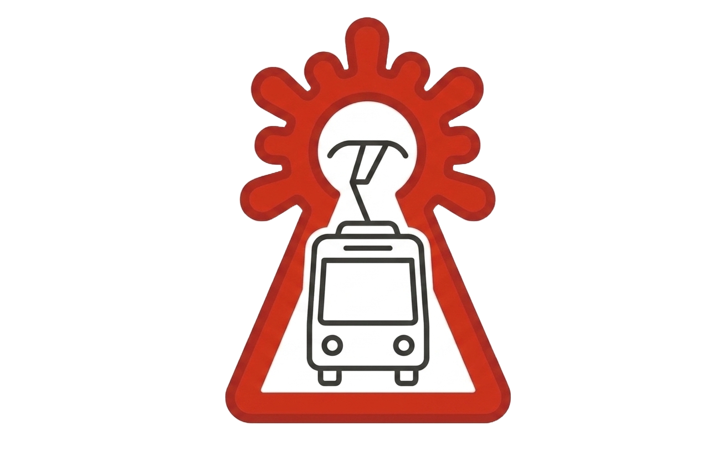

# Zaragoza Transporte



Integración de Home Assistant para el transporte urbano de Zaragoza: **tranvía y autobús** con tiempos de llegada en tiempo real.

Proyecto derivado de [Zaragoza_tram](https://github.com/jrgim/Zaragoza_tram) de @jrgim (licencia MIT), ampliado con soporte de autobús urbano y catálogo GTFS de paradas.

## Características

- **Tranvía**: sensores de próximos dos tranvías por parada (funcionalidad del proyecto original).
- **Autobús urbano**: sensores de próximo y siguiente bus por parada. Con una línea concreta, muestran esa línea; con "Todas - combinadas", mezclan las llegadas de todas las líneas de la parada y muestran la línea como atributo (`linea`), ideal para una tarjeta de "próximos autobuses"; con "Todas - una entidad por línea", crean un par próximo/siguiente por cada línea.
- **Asistente de configuración** desde la interfaz: busca la parada de bus por número, **por nombre** (sin necesidad de tildes) o **por cercanía** a tu Home Assistant.
- **Catálogo GTFS incluido**: 934 paradas con nombre real, coordenadas y líneas, derivado del GTFS oficial del [NAP del Ministerio de Transportes](https://nap.transportes.gob.es) (datos de Avanza Zaragoza S.A.U. y Tranvías Urbanos de Zaragoza S.L.).
- Los sensores de bus exponen `latitude`/`longitude`: la parada se muestra en la tarjeta de **mapa** de Home Assistant.
- Estado en **minutos** (número): `0` = en la parada, `unknown` = sin estimación. El texto original de la API queda como atributo.
- Tolerancia a fallos: la API municipal es inestable; si falla o devuelve un error, el componente hace **fallback automático a la web de tiempos de Avanza** y lo indica en el atributo `fuente` del sensor. Si ambas fallan, conserva el último dato válido.

## Instalación

### HACS
1. HACS → menú ⋮ → Repositorios personalizados → añade este repositorio (categoría *Integration*).
2. Busca "Zaragoza Transporte" e instala.
3. Reinicia Home Assistant.

### Manual
Copia `custom_components/zaragoza_transporte` a tu carpeta `custom_components` y reinicia.

> **Nota sobre el icono:** desde HA 2026.3 la integración incluye su propio icono en `custom_components/zaragoza_transporte/brand/` (sin depender de una PR a `home-assistant/brands`, vía cerrada para integraciones custom nuevas). Ya funciona en **Ajustes → Dispositivos y servicios**; en la ficha del repositorio dentro de la propia tienda de HACS puede seguir sin verse ("icon not available") hasta que HACS actualice su código para leer esta carpeta local — no depende de este repositorio.

## Configuración

**Ajustes → Dispositivos e integraciones → Añadir integración → Zaragoza Transporte**, elige Tranvía o Bus y sigue el asistente.

## Fuentes de datos

- Tiempos en tiempo real: [API de datos abiertos del Ayuntamiento de Zaragoza](https://www.zaragoza.es/sede/portal/datos-abiertos/) (catálogos 327 tranvía y 335 autobús).
- Catálogo de paradas: GTFS "Transporte urbano de Zaragoza" del NAP ([nap.transportes.gob.es](https://nap.transportes.gob.es)), base de datos libre y gratuita conforme a sus condiciones de uso.

El GTFS caduca periódicamente; para regenerar el catálogo descarga el ZIP actualizado del NAP (cuenta gratuita) y ejecuta:

```bash
python3 tools/generar_postes.py fichero_gtfs.zip
```

y coloca el `postes_bus.json` resultante en `custom_components/zaragoza_transporte/`.

## Hoja de ruta

- Soporte GTFS-RT si Avanza publica el feed de tiempo real (ya lo suministra a terceros).

## Créditos

- @jrgim por el componente original de tranvía.
- Ayuntamiento de Zaragoza, Avanza Zaragoza S.A.U. y NAP/MITMS por los datos.
